<table>
<tr>
<td width="50%" valign="middle">

# 👋 Hi, I'm Javeria Iqbal

### AI / NLP Researcher · Coder · Tea & Mountain Lover 🍵🏔️

*Powered by chai, curiosity, and clean code.*

Recent **BS Computer Science** graduate from **FAST-NUCES (CFD Campus)**, happily lost in AI and language. I build agentic AI systems, RAG pipelines, and fine-tuned transformers, and I'm currently researching multilingual speech emotion recognition. Open to **AI/ML research**, **bioinformatics tools**, and collaborations, so say hello!

</td>
<td width="50%" align="center" valign="middle">

</td>
</tr>
</table>

---

### 👀 About Me

- 🔬 Passionate about **Artificial Intelligence**, **NLP**, and **Bioinformatics**
- 🎓 Recent **BS Computer Science** graduate, **FAST-NUCES** (CFD Campus)
- 🤖 Building agentic AI systems, RAG pipelines, and fine-tuned transformer models
- 🌍 Currently researching **multilingual speech emotion recognition**
- 🤝 Open to **AI/ML research**, **bioinformatics tools**, and collaborative projects
- 📫 Reach me at **nakhalsheikh4@gmail.com**
- 😄 Pronouns: **She/Her**
- ⚡ Fun fact: solved 255+ LeetCode problems, and have a soft spot for creative UI design

---

### 🛠️ Languages, Frameworks & Tools

### 🧠 AI / NLP Focus

---

### 🚀 Top Projects

| Project | What it does | Built with |
|---|---|---|
| 🤖 **SmartAds** *(Final Year Project)* | Agentic AI platform that autonomously generates ad creatives, then publishes and tracks campaigns end to end | `Gemini API` `Veo 3.1 API`   |
| 🩺 **DiReCT** | RAG system over real clinical notes (MIMIC-IV-Ext) that answers diagnostic queries with context-aware summaries | `RAG`  `Streamlit` |
| 🧠 **Transformer Fine-Tuning** | Fine-tuned BERT, GPT-2, and T5/BART for sentiment analysis, generation, and summarization | `BERT` `GPT-2` `T5/BART` |
| 🎭 **Multimodal Sentiment Analysis** | Unified pipeline combining text, speech, and facial expressions into one sentiment prediction | `NLP` `Speech` `Computer Vision` |
| 🗣️ **Multilingual Emotion Recognition** | Ongoing research into cross-lingual speech emotion recognition via multitask learning & knowledge distillation | `Multitask Learning` `Knowledge Distillation` |

---

### 🏆 Achievements

---

### 📊 GitHub Stats

---

✨ *This is a special repository — its `README.md` appears on my GitHub profile.*
Feel free to explore my projects, check out my [portfolio](https://javeria530.github.io/), or reach out!

☕ *Let's build something thoughtful, one cup of tea at a time.*

